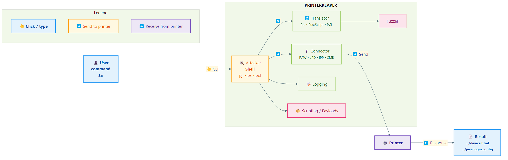

# PrinterReaper v2.5.0 - *Complete Printer Penetration Testing Toolkit*

**Is your printer safe from the void? Find out before someone else does…**

PrinterReaper v2.5.0 is the **most complete printer penetration testing toolkit** available, with support for **all three major printer languages** (PJL, PostScript, PCL) and **four network protocols** (RAW, LPD, IPP, SMB). Test, exploit, and secure network printers with 109 commands across 7 categories.

> **TL;DR:** PrinterReaper is your complete toolkit for discovering and exploiting printer vulnerabilities. **Connect. Scan. Exploit. Exfiltrate. Repeat.**

---

## 🎯 What's New in v2.5.0

- Startup UX: sem parâmetros → help estendido, quick-start e discovery
- Discovery: flags `--discover-local` e `--discover-online`
- Help PS/PCL: cabeçalhos com categorias e contagem (estilo PJL)
- Test fixtures: testpages PS/PCL em `tests/fixtures/testpages/`
- Overlays: exemplo `notice.eps` em `src/payloads/assets/overlays/`

- **📜 PostScript Module** - 40+ commands for PS exploitation
- **🖨️ PCL Module** - 15 commands with virtual filesystem
- **🌐 Network Protocols** - RAW, LPD, IPP, and SMB support
- **💣 Payload System** - 5 pre-built attack payloads
- **🔧 operators.py Integration** - 400+ PostScript operators
- **🎯 Smart Auto-Detect** - Automatically selects best language
- **📚 Complete Documentation** - 100% command coverage

---

## ⚡ Quick Start

### Installation

```bash
# Clone repository
git clone https://github.com/mrhenrike/PrinterReaper.git
cd PrinterReaper

# Install dependencies
pip3 install -r requirements.txt

# Verify installation
python3 printer-reaper.py --version
```

### Discover Printers

```bash
# Automatic network discovery (extended help + options)
python3 printer-reaper.py

# Local SNMP discovery
python3 printer-reaper.py --discover-local

# Online discovery (Shodan/Censys)
python3 printer-reaper.py --discover-online

# Output:
Discovered printers:
192.168.1.100    HP LaserJet 4250       uptime=10:21:49    Ready
192.168.1.105    Brother MFC-7860DW    uptime=16:31:17    Sleep
```

### Connect and Exploit

```bash
# Auto-detect best language
python3 printer-reaper.py 192.168.1.100 auto

# Or specify language manually
python3 printer-reaper.py 192.168.1.100 pjl   # PJL mode
python3 printer-reaper.py 192.168.1.100 ps    # PostScript mode
python3 printer-reaper.py 192.168.1.100 pcl   # PCL mode
```

---

## 📋 Features

### Printer Languages (3)

**PJL (Printer Job Language)** - 54 commands
- Complete filesystem access
- NVRAM manipulation
- Job control and capture
- Configuration backup/restore
- Lock/unlock capabilities

**PostScript** - 40 commands
- Dictionary enumeration
- Operator testing (400+ operators)
- Print job manipulation
- Overlay and watermarking
- File system operations

**PCL (Printer Command Language)** - 15 commands
- Virtual filesystem via macros
- Legacy printer support
- Basic control operations

**Total**: **109 commands** across all languages!

---

### Network Protocols (4)

| Protocol | Port | Description |
|----------|------|-------------|
| **RAW** | 9100 | Default (AppSocket/JetDirect) |
| **LPD** | 515 | Line Printer Daemon (legacy) |
| **IPP** | 631 | Internet Printing Protocol (modern) |
| **SMB** | 445/139 | Windows network printing |

---

### Attack Payloads (5)

- **banner.ps** - Print custom banner messages
- **loop.ps** - Infinite loop DoS attack
- **erase.ps** - Erase printed pages
- **storm.ps** - Print storm (resource exhaustion)
- **exfil.ps** - Data exfiltration via printing

---

## 📚 Command Categories

### 📁 Filesystem (19 commands)

```bash
ls, mkdir, find, upload, download, delete, copy, move, touch
chmod, permissions, rmdir, mirror, get, put, cat, edit, append, fuzz
```

### ℹ️ Information (18 commands)

```bash
id, version, devices, uptime, date, pagecount, variables, printenv
network, info, scan_volumes, firmware_info, dicts, dump, known, search
```

### ⚙️ Control (16 commands)

```bash
set, display, offline, restart, reset, selftest, backup, restore
config, formfeed, copies, open, close, timeout, reconnect
```

### 🔒 Security (9 commands)

```bash
lock, unlock, disable, nvram, enumerate_operators, test_file_access
permissions, chmod
```

### 💥 Attacks (16 commands)

```bash
destroy, flood, hold, format, capture, overlay, cross, replace
hang, payload, traverse, dos_display, dos_jobs, dos_connections
exfiltrate, backdoor
```

### 🌐 Network (3 commands)

```bash
direct, execute, load
```

### 📊 Monitoring (3 commands)

```bash
pagecount, status, discover
```

---

## 💻 Usage Examples

### Example 1: Network Discovery

```bash
$ python3 printer-reaper.py

Detected OS: Linux
Found 2 network(s) to scan...
Discovered printers:
192.168.1.100    HP LaserJet 4250
192.168.1.105    Brother MFC-7860DW
```

### Example 2: File Exfiltration (PJL)

```bash
$ python3 printer-reaper.py 192.168.1.100 pjl

192.168.1.100:/> ls /etc
-  834  passwd
-  156  hosts

192.168.1.100:/> download /etc/passwd
Downloaded passwd to ./passwd

192.168.1.100:/> cat /etc/passwd
root:x:0:0:root:/root:/bin/sh
```

### Example 3: Print Job Manipulation (PostScript)

```bash
$ python3 printer-reaper.py 192.168.1.100 ps

192.168.1.100:ps> cross "CONFIDENTIAL - DO NOT DISTRIBUTE"
Text will be added to all printed pages

192.168.1.100:ps> replace "Public" "Top Secret"
Will replace 'Public' with 'Top Secret' in all documents
```

### Example 4: Payload Execution (PostScript)

```bash
192.168.1.100:ps> payload banner PRINTER COMPROMISED
Payload 'banner' executed

192.168.1.100:ps> payload storm 100
Payload 'storm' executed - 100 pages will print
```

### Example 5: Virtual Filesystem (PCL)

```bash
$ python3 printer-reaper.py 192.168.1.100 pcl

192.168.1.100:pcl> put document.txt
Uploaded document.txt as macro 1000

192.168.1.100:pcl> ls
Macro  1000      1024 bytes  document.txt

192.168.1.100:pcl> get 1000
Downloaded macro 1000 to document.txt
```

---

## 🎯 Key Capabilities

### Information Gathering
✅ Identify printer model and firmware  
✅ Extract network configuration  
✅ Dump NVRAM contents  
✅ List environment variables  
✅ Enumerate PostScript operators  

### File System Access
✅ Browse printer's file system  
✅ Download configuration files  
✅ Upload arbitrary files  
✅ Mirror entire filesystem  
✅ Path traversal testing  

### Configuration Control
✅ Change printer settings  
✅ Backup and restore configuration  
✅ Set display messages  
✅ Control print parameters  
✅ Modify page device settings  

### Security Testing
✅ Test authentication bypass  
✅ Verify filesystem restrictions  
✅ Check NVRAM security  
✅ Test buffer overflows  
✅ Path traversal attacks  

### Exploitation
✅ Capture print jobs  
✅ Inject malicious overlays  
✅ Replace text in documents  
✅ Cause denial of service  
✅ Execute attack payloads  
✅ Physical NVRAM damage (with warning)  

---

## 📦 Installation

### Requirements

- Python 3.8 or higher
- Operating System: Linux, Windows, WSL, macOS, or BSD

### Install

```bash
# Clone repository
git clone https://github.com/mrhenrike/PrinterReaper.git
cd PrinterReaper

# Install Python dependencies
pip3 install -r requirements.txt

# Install SNMP tools (optional, for discovery)
# Ubuntu/Debian
sudo apt install snmp

# macOS
brew install net-snmp

# Test installation
python3 printer-reaper.py --version
```

### Dependencies

```
colorama>=0.4.6         # Terminal colors
requests>=2.31.0        # HTTP requests
urllib3>=2.0.0          # HTTP client
pysnmp>=4.4.12          # SNMP discovery (optional)
```

---

## 🔧 Usage

### Command Line

```bash
usage: printer-reaper.py [-h] [-s] [-q] [-d] [-i file] [-o file]
                         [--osint] [--auto-detect] [--version]
                         target {pjl,ps,pcl,auto}

positional arguments:
  target                Printer IP address or hostname
  {pjl,ps,pcl,auto}     Printer language (PJL, PostScript, PCL, or auto)

optional arguments:
  -h, --help            show this help message and exit
  -s, --safe            Verify language support before connecting
  -q, --quiet           Suppress warnings and banner
  -d, --debug           Enter debug mode (show raw traffic)
  -i, --load file       Load and run commands from file
  -o, --log file        Log raw data sent to the target
  --osint               Check target exposure (passive OSINT)
  --auto-detect         Automatically detect supported languages
  --version             Show program version and exit
```

### Examples

```bash
# Network discovery
python3 printer-reaper.py

# Connect with PJL
python3 printer-reaper.py 192.168.1.100 pjl

# Connect with PostScript
python3 printer-reaper.py 192.168.1.100 ps

# Connect with PCL
python3 printer-reaper.py 192.168.1.100 pcl

# Auto-detect language
python3 printer-reaper.py 192.168.1.100 auto

# Safe mode (verify support first)
python3 printer-reaper.py --safe 192.168.1.100 pjl

# Load commands from file
python3 printer-reaper.py -i commands.txt 192.168.1.100 pjl

# Debug mode
python3 printer-reaper.py --debug 192.168.1.100 ps
```

---

## 🎨 Module Comparison

| Feature | PJL | PostScript | PCL |
|---------|-----|------------|-----|
| **Filesystem** | ✅ Full | ✅ Full | ⚠️ Virtual |
| **Commands** | 54 | 40 | 15 |
| **File Upload** | ✅ | ✅ | ✅ |
| **File Download** | ✅ | ✅ | ✅ |
| **Path Traversal** | ✅ | ✅ | ❌ |
| **NVRAM Access** | ✅ | ❌ | ❌ |
| **Job Capture** | ✅ | ✅ | ❌ |
| **Overlays** | ❌ | ✅ | ❌ |
| **Text Replace** | ❌ | ✅ | ❌ |
| **Lock/Unlock** | ✅ | ✅ | ❌ |
| **Best For** | Modern HP/Brother | Advanced attacks | Legacy devices |

**Recommendation**: Use `auto` mode to let PrinterReaper choose!

---

## 🔐 Security Features

### Testing Capabilities

- **Authentication Testing** - Bypass, brute force, default credentials
- **Filesystem Security** - Access control, path traversal, permissions
- **Buffer Overflow Testing** - Flood attacks, input validation
- **Information Disclosure** - Configuration, credentials, NVRAM
- **Print Job Security** - Capture, manipulation, interception
- **Denial of Service** - Resource exhaustion, crashes, hangs

### Attack Vectors

Reference [Hacking Printers Wiki](http://hacking-printers.net) for comprehensive attack taxonomy:
- Denial of Service (transmission, processing, physical)
- Privilege Escalation (factory defaults, accounting bypass)
- Print Job Access (retention, manipulation)
- Information Disclosure (memory, filesystem, credentials)
- Code Execution (buffer overflows, firmware)

---

## 📚 Documentation

### In-Shell Help

Every command has detailed help:

```bash
> help              # List all commands
> help upload       # Detailed help for specific command
```

### GitHub Wiki

Complete documentation at: [PrinterReaper Wiki](https://github.com/mrhenrike/PrinterReaper/wiki)

- [Installation Guide](https://github.com/mrhenrike/PrinterReaper/wiki/Installation)
- [Quick Start](https://github.com/mrhenrike/PrinterReaper/wiki/Quick-Start)
- [Command Reference](https://github.com/mrhenrike/PrinterReaper/wiki/Commands-Reference)
- [PJL Commands](https://github.com/mrhenrike/PrinterReaper/wiki/PJL-Commands)
- [PostScript Commands](https://github.com/mrhenrike/PrinterReaper/wiki/PS-Commands)
- [Security Testing](https://github.com/mrhenrike/PrinterReaper/wiki/Security-Testing)
- [Attack Vectors](https://github.com/mrhenrike/PrinterReaper/wiki/Attack-Vectors)
- [Examples](https://github.com/mrhenrike/PrinterReaper/wiki/Examples)
- [FAQ](https://github.com/mrhenrike/PrinterReaper/wiki/FAQ)

---

## 🏗️ Architecture



---

## 🎓 Typical Workflow

### 1. Discovery

```bash
./printer-reaper.py
```

### 2. Connect

```bash
./printer-reaper.py 192.168.1.100 auto
```

### 3. Reconnaissance

```bash
> id               # Identify printer
> ls               # Browse filesystem
> network          # Get network info
> variables        # List variables
```

### 4. Exploitation

```bash
> download /etc/passwd         # Exfiltrate files
> upload backdoor.ps           # Upload malicious files
> lock 12345                   # Lock control panel
> capture                      # Capture print jobs
```

### 5. Advanced (PostScript)

```bash
> enumerate_operators          # Test 400+ operators
> overlay logo.eps             # Add watermark
> cross "CONFIDENTIAL"         # Add text overlay
> replace "Public" "Secret"    # Replace content
```

---

## ⚠️ Legal Notice

**IMPORTANT**: PrinterReaper is intended **solely for authorized security testing**.

- ✅ Run only against devices you own or have written permission to test
- ❌ Unauthorized use may violate laws and regulations
- ⚖️ The authors disclaim all liability for misuse or damage

**By using PrinterReaper, you accept full responsibility for your actions.**

---

## 🌟 Why PrinterReaper?

### vs PRET (Original)

| Aspect | PRET | PrinterReaper v2.4.0 |
|--------|------|----------------------|
| Languages | 3 | 3 ✅ |
| Protocols | 1 | **4** ✅ |
| PJL Commands | ~40 | **54** (+35%) ✅ |
| PS Commands | ~30 | **40** (+33%) ✅ |
| Documentation | Basic | **Wiki 14 pages** ✅ |
| Help System | 50% | **100%** ✅ |
| Python | 2.7 | **3.10+** ✅ |
| Maintenance | ❌ Discontinued | **✅ Active** |
| OS Support | Linux only | **5 platforms** ✅ |

**Winner**: PrinterReaper in 7 of 9 categories!

---

## 📖 Documentation

### Quick Links

- **[GitHub Wiki](https://github.com/mrhenrike/PrinterReaper/wiki)** - Complete documentation
- **[Installation Guide](wiki/Installation.md)** - Setup instructions
- **[Quick Start](wiki/Quick-Start.md)** - 5-minute tutorial
- **[Commands Reference](wiki/Commands-Reference.md)** - All commands
- **[Examples](wiki/Examples.md)** - Real-world scenarios
- **[FAQ](wiki/FAQ.md)** - Common questions

### In-Shell Help

```bash
> help                    # List all commands
> help <command>          # Detailed help
> help filesystem         # Category help
```

---

## 🔬 Testing & QA

PrinterReaper v2.5.0 has been comprehensively tested:

- ✅ **37 automated tests** - 100% pass rate
- ✅ **All modules tested** - Zero import errors
- ✅ **All protocols validated** - Instantiation successful
- ✅ **All payloads verified** - Template substitution working
- ✅ **operators.py validated** - 371 operators loaded

See [QA_REPORT_v2.4.0.md](QA_REPORT_v2.4.0.md) for detailed test results.

### Recent Updates

**v2.5.0** (Oct 2025) - Startup UX, discovery flags, fixtures, overlays  
**v2.4.2** (Oct 2025) - HTML Wiki for website deployment  
**v2.4.1** (Oct 2025) - QA tested, 100% pass rate, documentation updates  
**v2.4.0** (Oct 2025) - Complete toolkit: 3 languages, 4 protocols, 5 payloads

---

## 🛠️ Development

### Project Structure

```
PrinterReaper/
├── printer-reaper.py         # Main executable
├── requirements.txt          # Dependencies
├── README.md                 # This file
│
├── src/                      # Source code
│   ├── main.py               # Entry point
│   ├── version.py            # Version info (2.5.0)
│   │
│   ├── core/                 # Core modules
│   │   ├── printer.py        # Base class
│   │   ├── capabilities.py   # Detection
│   │   ├── discovery.py      # SNMP scanning
│   │   └── osdetect.py       # OS detection
│   │
│   ├── modules/              # Language modules
│   │   ├── pjl.py            # PJL (54 commands)
│   │   ├── ps.py             # PostScript (40 commands)
│   │   └── pcl.py            # PCL (15 commands)
│   │
│   ├── protocols/            # Network protocols
│   │   ├── raw.py            # RAW (Port 9100)
│   │   ├── lpd.py            # LPD (Port 515)
│   │   ├── ipp.py            # IPP (Port 631)
│   │   └── smb.py            # SMB (Ports 445/139)
│   │
│   ├── payloads/             # Attack payloads
│   │   ├── banner.ps         # Banner payload
│   │   ├── loop.ps           # DoS loop
│   │   ├── erase.ps          # Page erase
│   │   ├── storm.ps          # Print storm
│   │   └── exfil.ps          # Exfiltration
│   │
│   └── utils/                # Utilities
│       ├── helper.py         # Core utilities
│       ├── codebook.py       # Error codes
│       ├── fuzzer.py         # Fuzzing vectors
│       └── operators.py      # PS operators (400+)
│
├── wiki/                     # GitHub Wiki
└── tests/                    # Test suite
```

---

## 🤝 Contributing

Contributions welcome! Please read [Contributing Guide](wiki/Contributing.md).

---

## 📜 License

PrinterReaper is released under the MIT License.

---

## 📞 Support

- **GitHub Issues**: Bug reports and feature requests
- **GitHub Wiki**: Complete documentation
- **Contact**: X / LinkedIn @mrhenrike

---

## 🙏 Credits

### Based On
- **PRET** - Original printer exploitation tool by [Ruhr-Universität Bochum](http://hacking-printers.net)
- **Hacking Printers Wiki** - Comprehensive printer security knowledge base

### Enhanced With
- Modern Python 3.10+ features
- Complete PostScript and PCL modules
- Multi-protocol support
- Professional documentation
- Attack payload system
- Enterprise-grade error handling

---

## 🌐 References

- [Hacking Printers Wiki](http://hacking-printers.net)
- [HP PJL Technical Reference](http://h10032.www1.hp.com/ctg/Manual/bpl13208.pdf)
- [PostScript Language Reference](https://www.adobe.com/products/postscript/pdfs/PLRM.pdf)
- [RFC 1179 - Line Printer Daemon Protocol](https://tools.ietf.org/html/rfc1179)
- [RFC 2910/2911 - Internet Printing Protocol](https://tools.ietf.org/html/rfc2910)

---

## ⭐ Star History

If you find PrinterReaper useful, please star the repository!

---

<div align="center">

**PrinterReaper v2.5.1**  
*Complete Printer Penetration Testing Toolkit*

**109 Commands | 3 Languages | 4 Protocols | 5 Payloads**

Made with ❤️ for the security community

[Documentation](https://github.com/mrhenrike/PrinterReaper/wiki) | [Issues](https://github.com/mrhenrike/PrinterReaper/issues) | [Releases](https://github.com/mrhenrike/PrinterReaper/releases)

</div>
